


 

 



  


 

  

  

  

 


 

  <a href="https://github.com/vedant7007/offstage"></a>
  <a href="https://github.com/vedant7007/delta-carbon-coach"></a>

  <a href="https://github.com/vedant7007/nirvaachan-ai"></a>
  <a href="https://github.com/vedant7007/Krishi_sathi"></a>

  <a href="https://github.com/vedant7007/clausewise"></a>
  <a href="https://github.com/vedant7007/SIHSIH"></a>

  
    Live demos:
    <a href="https://offstage-live.vercel.app">OFFSTAGE</a> ·
    <a href="https://delta-916653092249.asia-south1.run.app">Delta</a> ·
    <a href="https://nirvaachan-ai-504882606553.asia-south1.run.app">NirvaachanAI</a> ·
    <a href="https://krishisathi-rose.vercel.app">KrishiSathi</a> ·
    <a href="https://clausewise-lovat.vercel.app">ClauseWise</a>
  

 


 


<b>More along the way</b>

 

- **HackerRank Orchestrate:** solo 24-hr RAG support-triage agent, 9/10 accuracy for about $0.20 in API cost
- **Google Cloud Gen AI Academy APAC:** SmartCareer AI multi-agent system on Cloud Run
- **India Innovates 2026:** presented NagrikaSeva AI at Bharat Mandapam
- **Murf AI Voice Agents Challenge:** 9 days of LiveKit voice agents
- **Google Gemini Student Ambassador** (2025) · **Anthropic Academy** (Claude, MCP, Agents, AI Fluency)
- **Open source:** GSSoC 2026 contributor

 


 

  
    
  
    
  <picture>
    <source media="(prefers-color-scheme: dark)" srcset="https://raw.githubusercontent.com/vedant7007/vedant7007/output/snake-dark.svg" />
    <source media="(prefers-color-scheme: light)" srcset="https://raw.githubusercontent.com/vedant7007/vedant7007/output/snake-light.svg" />
    
  </picture>

 


 

**Open to SDE internships, hackathon teams and open source collabs.**

  

