<picture>
  <source media="(prefers-color-scheme: dark)" srcset="./assets/hero-dark.svg" />
  <source media="(prefers-color-scheme: light)" srcset="./assets/hero-light.svg" />
  
</picture>

### Things I've built

| | What it does | How it went |
|:--|:--|:--|
| **[OFFSTAGE](https://github.com/vedant7007/offstage)**  [live](https://offstage-live.vercel.app) | An AI event operations team: 14 agents, each paired with one human lead | 1st prize, AIML Hacks 2026 |
| **[Delta](https://github.com/vedant7007/delta-carbon-coach)**  [live](https://delta-916653092249.asia-south1.run.app) | Carbon footprint coach where a deterministic engine owns every number and Gemini only structures text | 3rd, Google PromptWars C3 (97.44) |
| **[KrishiSathi](https://github.com/vedant7007/Krishi_sathi)**  [live](https://krishisathi-rose.vercel.app) | Voice-first farming help in the farmer's own language, by voice, text or phone call | 4th of 170+, ForgeAscend. I wrote all 48+ APIs in 24 hours |
| **[NirvaachanAI](https://github.com/vedant7007/nirvaachan-ai)**  [live](https://nirvaachan-ai-504882606553.asia-south1.run.app) | Teaches first-time voters how Indian elections work | 43rd of 2,600+, Google PromptWars C2 |
| **[ClauseWise](https://github.com/vedant7007/clausewise)**  [live](https://clausewise-lovat.vercel.app) | Reads rental agreements, offer letters and NDAs so you know what you're signing | Built for PromptWars Virtual |
| **[VSMART](https://github.com/vedant7007/SIHSIH)** | Blockchain registry for issuing and trading carbon credits | Top 50, SIH 2025 internal round |

Also shortlisted for the AlgoUniversity Tech Fellowship (top 0.2% of 250,000+), 2nd in VJIT's IRCTC redesign contest, and a solo 24-hour RAG support agent at HackerRank Orchestrate that scored 9/10 for about $0.20 in API calls.

### What I work with

- **Web:** TypeScript, Next.js, React, Tailwind, GSAP, React Three Fiber
- **Backend:** Node.js, Express, MongoDB, Firebase
- **AI:** Gemini API, Anthropic API, MCP, LangChain, RAG pipelines, LiveKit voice agents
- **Cloud:** AWS, Google Cloud Run, Vercel, Docker
- **Also:** Python, C++, Java

### Say hi

I'm open to SDE internships, hackathon teams and open source collabs. Email me at [vedantidlgave16@gmail.com](mailto:vedantidlgave16@gmail.com).
